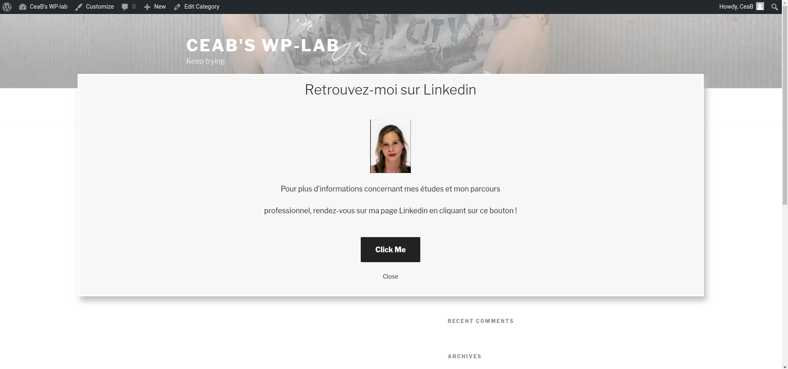

# *Exitpopup Plugin*

## Plugin WordPress permettant d'ajouter aux articles un pop-up apparaissant lorsque la souris de l'utilisateur quitte l'écran.

Résultat :

### Contenu d'un pop-up :
  * un titre
  * un petit texte descriptif/explicatif
  * un bouton ouvrant un nouvel onglet avec l'URL souhaitée

### Utilisation :

  1. Créer un pop-up :
    * Cliquez sur l'onglet *Exit popup plugin* dans le menu de gauche du dashboard, puis sur *Add New*.

    * Entrez le titre, le texte et le lien du bouton de votre pop-up et sauvegardez.

  2. Le lier à un article :

    * Cliquez sur l'onglet *Posts*, sélectionnez un article et ouvrez l'éditeur.

    * Choisissez un pop-up dans la box *Activate an "exit pop-up"* et sauvegardez

Remarques :
  * Vous pouvez en créer et en enregistrer autant que vous le souhaitez, et pouvez les éditer par la suite, comme les articles.

  * Un seul pop-up par article

#### Auteur :
  * [Caroline Bieuvelet](https://github.com/carolinebvlt) (CeaB)
